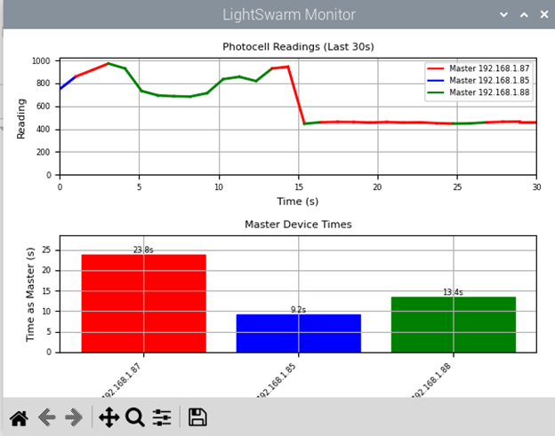

# LightSwarm System using ESP8266 and RaspberryPi
## 1. System Schematic
```
                      +---------------+
                      |   Router      |
                      | 192.168.1.xxx |
                      +-------+-------+
                              |
                    +---------+---------+
                    |         |         |
            +-------+--+ +----+----+ +--+-------+
            |ESP8266 #1| |ESP8266 #2| |ESP8266 #3|
            |  A0: LDR | |  A0: LDR | |  A0: LDR |
            +----------+ +---------+ +----------+
                    \         |        /
                     \        |       /
                      \       |      /
                   +---+------+------+---+
                   |   Raspberry Pi 4    |
                   |   GPIO Connections: |
                   | PIN 27: RED LED     |
                   | PIN 23: GREEN LED   |
                   | PIN 22: YELLOW LED  |
                   | PIN 24: WHITE LED   |
                   | PIN 15: Reset Button|
                   +--------------------+

```

### 1.1 Components Used
- 1× Raspberry Pi (Controller)
- 3× ESP8266 (Sensor Nodes)
- 7× LEDs + Resistors (Pi Display)
- 1× Onboard LEDs per ESP8266
- 1× Push Button (Reset Control)
- 3× Photoresistors (Light Sensing)
## 2. Hardware Configuration
### RaspberryPi Setup

```
LED Connections:
┌─────────────┬──────────────┬─────────┐
│ Component   │ GPIO Pin     │ State   │
├─────────────┼──────────────┼─────────┤
│ Red LED     │ GPIO27 (330Ω)│ Active H│
│ Green LED   │ GPIO23 (330Ω)│ Active H│
│ Yellow LED  │ GPIO22 (330Ω)│ Active H│
│ White LED   │ GPIO24 (330Ω)│ Active H│
│ Reset Button│ GPIO15       │ Pull-DN │
└─────────────┴──────────────┴─────────┘
```

### ESP8266 Setup

```
Sensor Circuit:
┌─────────────┬──────────────┬─────────┐
│ Component   │ Pin          │ Notes   │
├─────────────┼──────────────┼─────────┤
│ Light Sensor│ A0           │ Analog  │
│ Status LED  │ GPIO2        │ Active L│
│ Master LED  │ GPIO5  (220Ω)│ Active H│
└─────────────┴──────────────┴─────────┘
```
# RaspberryPi - Part 1


## 1. Communication Protocol

### Messages:
1. From ESP8266 to RPi:
   ```
   LIGHT:<device_id>:<reading>    // Regular light reading broadcast
   MASTER:<device_id>:<reading>   // Master status broadcast
   ```

2. From RPi to ESP8266:
   ```
   RESET                          // System reset command
   ACTIVATE                       // System activation command
   ```

## 2. Raspberry Pi State Flow Chart


## 3. Main Functionality

### Input
- UDP packets from ESP8266s containing light sensor readings
- Reset button state changes
- System commands (Ctrl+C for shutdown)

### Process
- Track master ESP based on highest light reading
- Maintain LED assignments for each ESP
- Calculate flash delays based on readings
- Generate real-time plots of sensor data
- Track master duration times

### Output
- LED status indicators (RED/GREEN/YELLOW for ESPs, WHITE for system state)
- Real-time graphical display showing:
  - Light readings over time
  - Master duration times
- Log file with timestamped readings and master data

## 4. Data Collection Flowchart


## 5. Data Structure and Logging

The system maintains several key data structures:
1. `device_data`: Dictionary tracking current state of each ESP
   ```python
   {
       device_id: {
           'reading': int,          # Current light reading
           'last_seen': timestamp,  # Last packet time
           'addr': string           # IP address
       }
   }
   ```
2. `master_times`: Dictionary tracking duration each ESP has been master
   ```python
   {
       ip_address: float  # Total seconds as master
   }
   ```

Log files are created with timestamp filenames (e.g., `lightswarm_20240118_123456.log`) and contain CSV-formatted data with headers.

## 6. DEMO

### 6.1 Visualization of the System


### 6.2 Example Log File Output
```
=== New Session Started at 2024-01-18 12:34:56 ===
Format: timestamp, device_id, ip_address, reading, master_duration
===========================================

2024-01-18 12:34:57, 1234, 192.168.1.101, 856, 0.00
2024-01-18 12:34:58, 1234, 192.168.1.101, 862, 1.02
2024-01-18 12:34:58, 5678, 192.168.1.102, 734, 0.00
2024-01-18 12:34:59, 1234, 192.168.1.101, 878, 2.04
2024-01-18 12:34:59, 5678, 192.168.1.102, 745, 0.00
2024-01-18 12:35:00, 9012, 192.168.1.103, 912, 0.00
2024-01-18 12:35:00, 1234, 192.168.1.101, 865, 3.06
2024-01-18 12:35:01, 9012, 192.168.1.103, 923, 1.00
```

Each log entry captures the exact timestamp, device ID, IP address, current light reading, and cumulative time that device has been master, providing a complete history of system operation and master transitions.

# ESP8266 System  - Part 2

## 1. ESP8266 State Flow Chart


    

## 2. State Descriptions

### 1. Initialization
- Setup WiFi connection and UDP socket
- Configure GPIO pins (A0 for LDR, GPIO2 for onboard LED, GPIO5 for external LED)
- Generate unique device ID from MAC address
- Initialize communication parameters

### 2. Active State (Normal Operation)
- DataCollection: Read photoresistor value every 100ms
- MasterCheck: Compare readings with other ESPs
- Master/Non-Master modes:
  * Master: Flash LED at speed based on light level, broadcast MASTER messages
  * Non-Master: Keep LED off, broadcast LIGHT messages

### 3. Inactive State
- Entered when RESET received
- All LEDs off
- No sensor readings or broadcasts
- Wait for ACTIVATE command

## 3. Main Functionality

### Input
```cpp
// Sensor Input
const int LIGHT_SENSOR_PIN = A0;    
currentReading = analogRead(LIGHT_SENSOR_PIN);  // 0-1023 range

// Network Input
// UDP packets received:
struct SwarmData {
    int reading;
    unsigned long lastUpdate;
    int deviceID;
};
```

### Process
```cpp
// Master determination
void updateMasterStatus() {
    // Compare readings with other devices
    bool shouldBeMaster = true;
    for (device in swarmReadings) {
        if (device.reading > currentReading || 
           (device.reading == currentReading && 
            device.deviceID > deviceID)) {
            shouldBeMaster = false;
            break;
        }
    }
    
    // Handle master status changes
    if (shouldBeMaster != isMaster) {
        if (shouldBeMaster) {
            // Wait period before claiming master
            delay(masterClaimTimeout);
            // Verify still highest
            if (stillHighest) {
                isMaster = true;
            }
        } else {
            isMaster = false;
        }
    }
}

// LED Control
float calculateFlashDelay(int reading) {
    return max(0.1, 1.0 - (reading / 1023.0 * 0.9));
}
```

### Output
```cpp
// Network Output
void sendMasterUpdate() {
    char message[32];
    snprintf(message, sizeof(message), 
             "MASTER:%d:%d", deviceID, currentReading);
    // Send twice for reliability
    for (int i = 0; i < 2; i++) {
        udp.beginPacketMulticast(broadcastIP, UDP_PORT, WiFi.localIP());
        udp.write(message);
        udp.endPacket();
        delay(2);
    }
}

void broadcastReading() {
    char message[32];
    snprintf(message, sizeof(message), 
             "LIGHT:%d:%d", deviceID, currentReading);
    udp.beginPacketMulticast(broadcastIP, UDP_PORT, WiFi.localIP());
    udp.write(message);
    udp.endPacket();
}

// LED Output
// Onboard LED (GPIO2): Master status indicator
// External LED (GPIO5): Light level indicator
// Master LED flashing rate varies with light level
// Non-master LEDs remain off
```
## 4. Example
### 4.1 Master Monitor Window

### 4.2 Slave Monitor Window


## 5. Key Features
1. Autonomous master election based on light readings
2. Self-stabilizing network through continuous reading comparison
3. Visual feedback through LED patterns
4. Resilient to network issues through:
   - Multiple message sends
   - Timeout handling
   - Master claim verification
5. Responsive to system controls (RESET/ACTIVATE)
